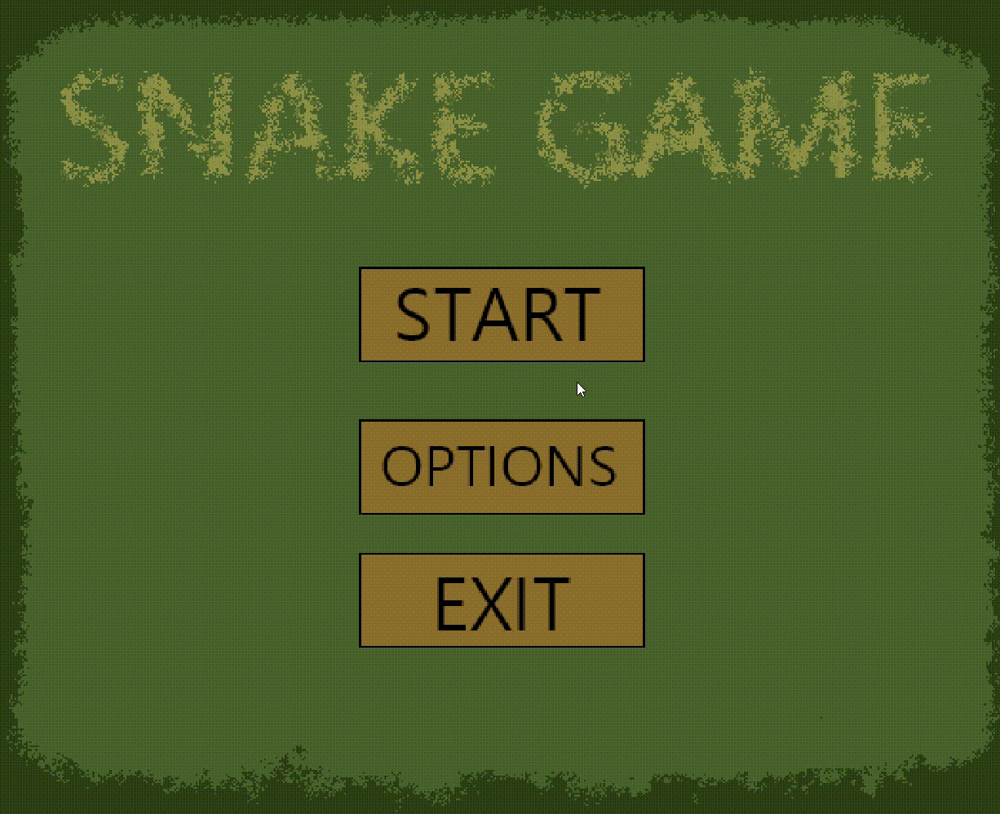

#Snake Game SDL3

A Snake Game written in C++ using SDL3

##Features
- Multiple levels
- Difficulty modes
- Save system
- Audio and music
- Pause menu
- Volume Slider

##Gameplay


## Technologies
- C++
- SDL3
- SDL_image
- SDL_mixer

##Controls
- Arrow keys to move
- ESC to pause

## Build
```bash
git clone <repo-url>
cd SnakeGame

cmake -B build
cmake --build build
